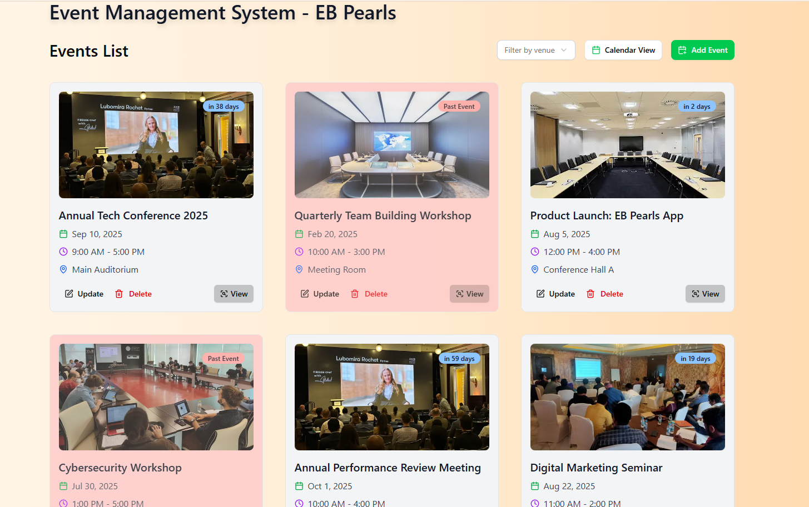
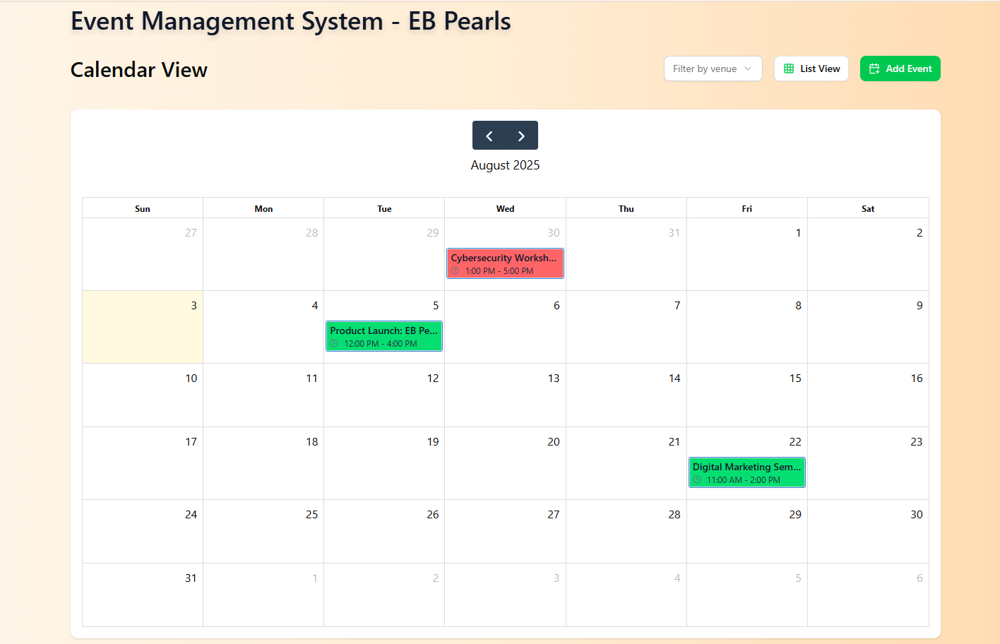
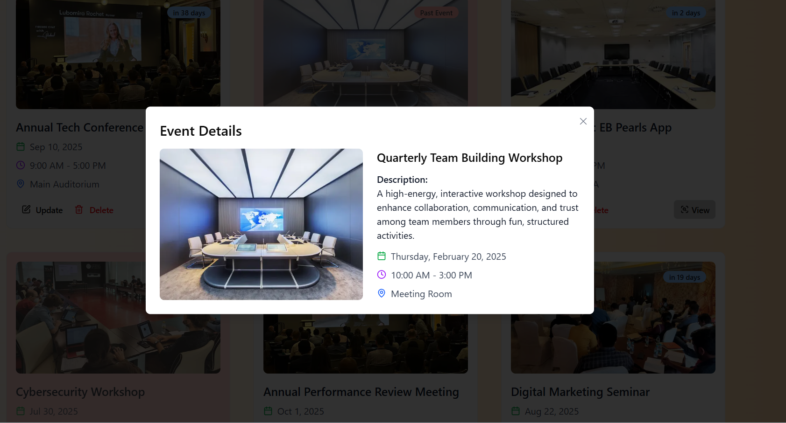
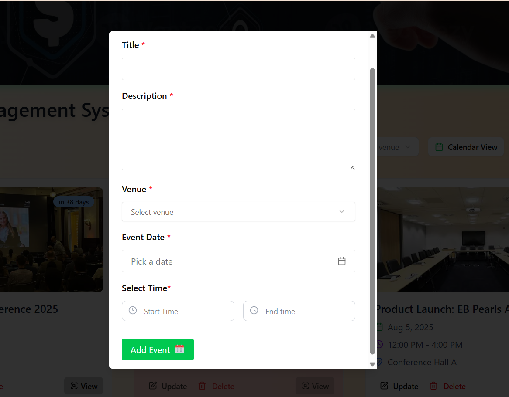
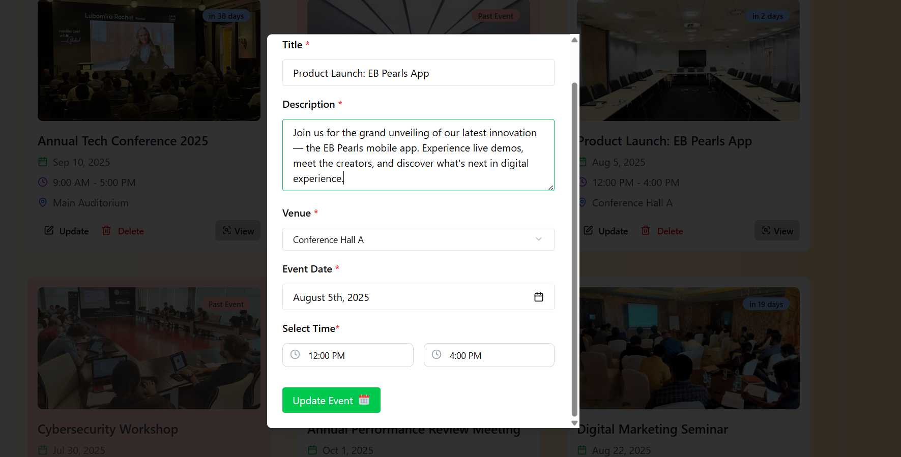
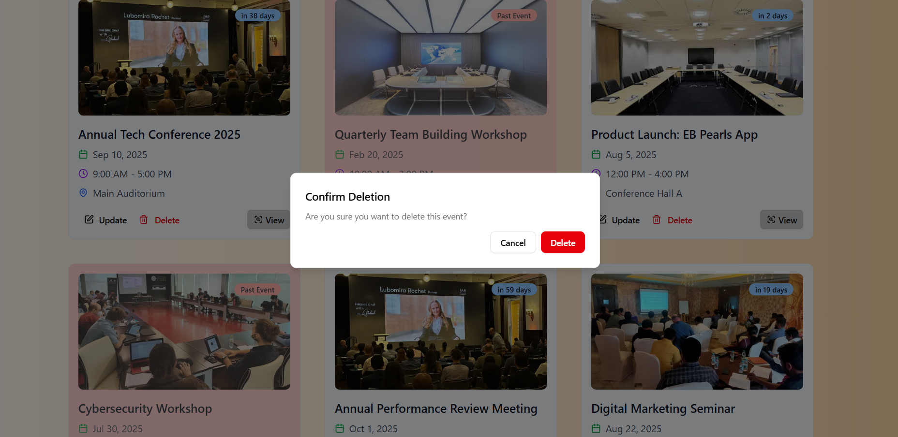

# 🎉 Event Management System

A simple and clean Event Management app built with **Next,js**, **TypeScript**, **Shadcn UI**, and **react-hook-form**.

## 🚀 Live Demo

🌐 [View Live App](https://event-management-system-task.vercel.app/)

---

## 📌 Features

- ✅ Add new event (title, description, venue, date) with venue + date conflict validation
- ✅ View events in List View and Calender View.
- ✅ View event list with past event highlight
- ✅ Update event with venue + date conflict validation
- ✅ Delete events
- ✅ Events details in a Preview Modal

---

## 🛠️ Tech Stack

- Next.js
- TypeScript
- SHADCN UI
- react-hook-form
- localStorage (for storing Data)

---

## 📷 Screenshots

### 📃 Event List View


---

### 📅 Calendar View


---

### 👁️ Event Preview Modal


---

### 📝 Add Event 


---

### ✏️ Update Event 


---

### ✏️ Delete Event 



## 📦 Setup Instructions

To run this project locally:

```bash
# Clone the repo
git clone https://github.com/manish2588/Event-Management-System---Task.git

# Navigate to the project folder
cd Event-Management-System---Task

# Install dependencies
npm install

# Start the development server
npm run dev
```
